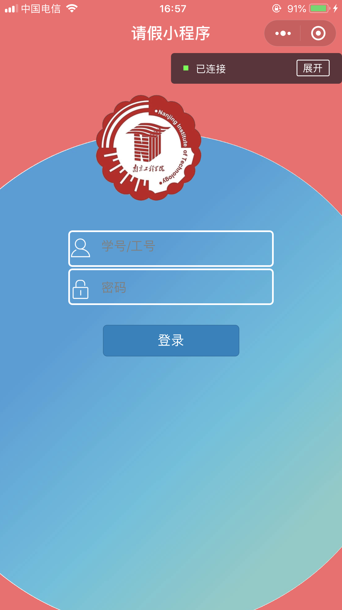
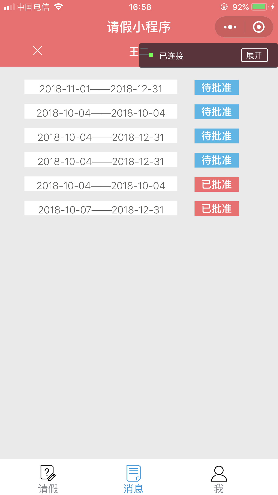
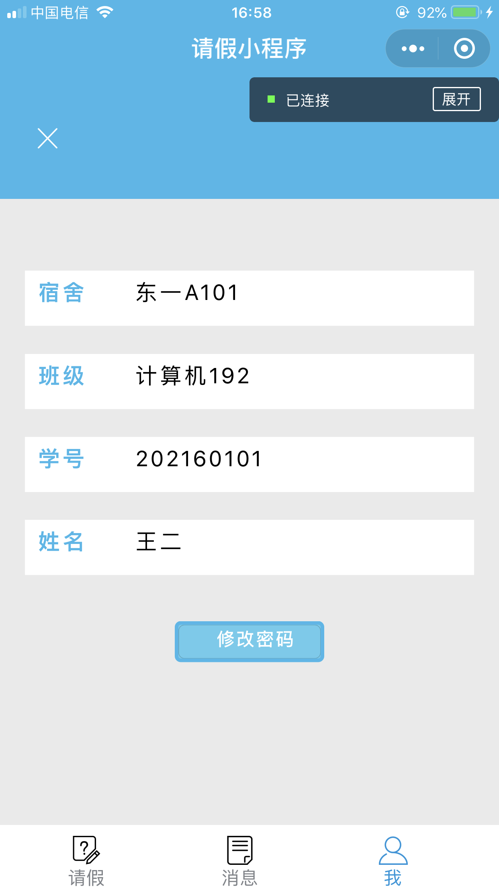
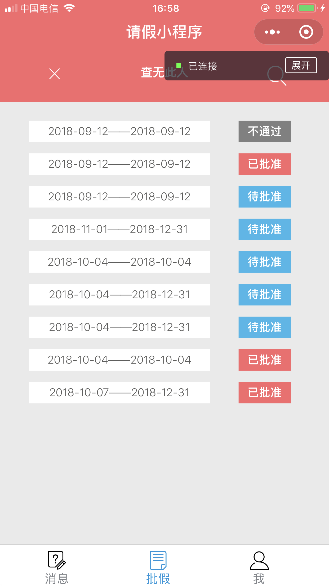
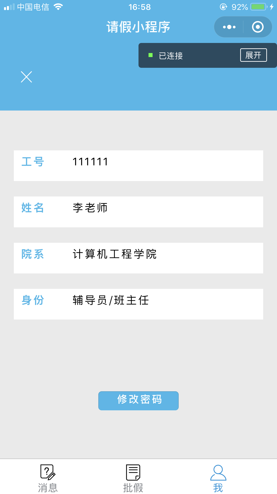
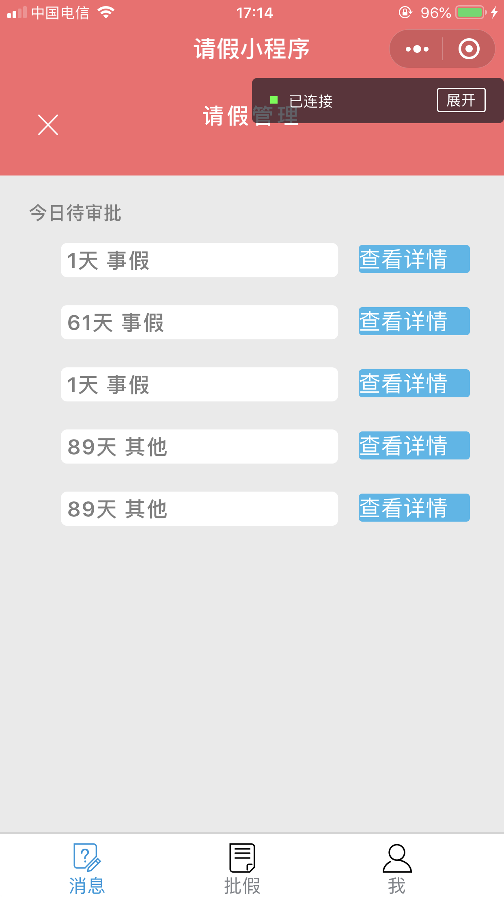
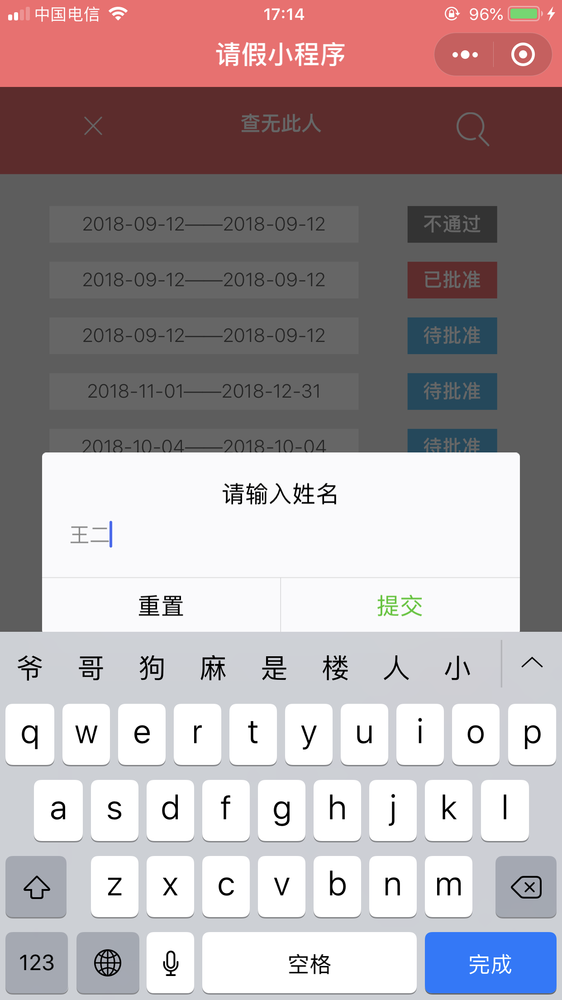
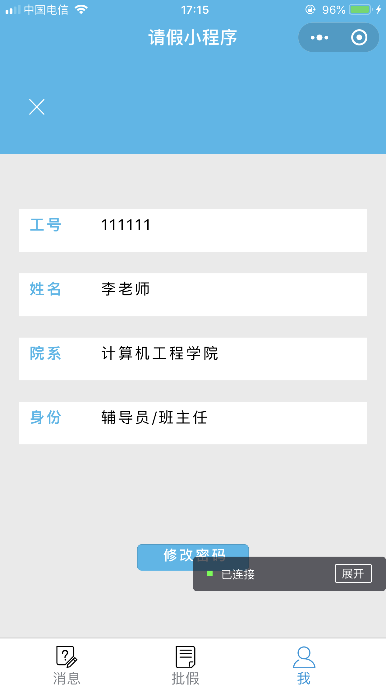
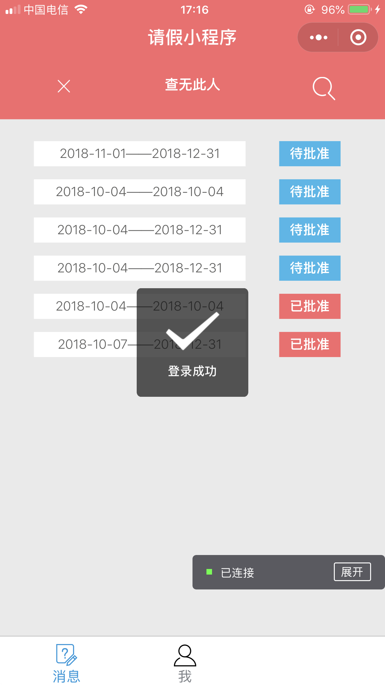

# leave-miniprogram

基于Flask+MySQL开发的开源在线请假系统（微信小程程序），包含前后端完整源代码和数据库设计 

**仓库路径声明**

- [Images&UI](Images&UI) 为设计图和icon，logo

- [frontend](frontend) 为微信小程序源代码

- [backend](backend) 为后端源代码

- [docs](docs) 为数据库设计文档，调试记录，流程图和真机调试截图

**用户需求**：

- 学生提交请假请求，查看自己的请假详情和请假是否被批准等情况

- 辅导员管理学生的请假请求，查看学生请假记录

- 任课老师接查看学生的请假请求和是否被批准情况

### 开发人员

UI/UE：ZYN

前端：[Fuhaixu](https://github.com/Fuhaixu) & [xuyongxiang](https://github.com/xuyongxiang134)

后端&数据库： [Joey](https://github.com/Joey66666)

### 用户身份

1. 学生，用户名为学号， 长度9位
2. 辅导员，用户名为工号， 长度6位
3. 任课教师，用户名为工号， 长度6位

### 技术栈

前端：微信小程序

后端：Flask+微信云开发（上传图片功能使用云开发，其他功能使用Flask）

数据库：MySQL

***

## 功能流程

***

## 架构设计

***

## 数据库设计

### 3个Table

|  名称   |    解释    |
| :-----: | :--------: |
| student | 学生信息表 |
| teacher | 教师信息表 |
|  leave  |   请假表   |

***

##### 1. student-学生表

|       名称        |   解释   | 数据类型-长度 |
| :---------------: | :------: | :-----------: |
| student_id(主key) | 学生学号 |  decimal-65   |
|       name        | 学生姓名 |  varchar-255  |
|      s_class      | 学生班级 |  varchar-255  |
|      passwd       | 账号密码 |  varchar-255  |
|       room        | 学生宿舍 |  varchar-255  |

##### 2. teacher-教师表

|       名称        |               解释               | 数据类型-长度 |
| :---------------: | :------------------------------: | :-----------: |
| teacher_id(主key) |             教师工号             |  decimal-65   |
|       name        |             教师姓名             |  varchar-255  |
|      passwd       |             账号密码             |  varchar-255  |
|       role        | 教师身份(0为辅导员，1为任课老师) |     int-2     |

##### 3. leave-请假表

|       名称       |                    解释                     | 数据类型-长度 |
| :--------------: | :-----------------------------------------: | :-----------: |
| leave_num(主key) |                  唯一索引                   |  decimal-65   |
|    student_id    |     学生学号(与学生表中student_id关联)      |  decimal-65   |
|    start_time    |                请假开始时间                 |  datetime-0   |
|     end_time     |                请假结束时间                 |  datetime-0   |
|      reason      |                  请假理由                   |  varchar-255  |
|       flag       | 请假是否批准状态(0不通过，1待批准，2已批准) |     int-2     |
|       type       |       请假种类（1事假，2病假，3其他）       |  decimal-65   |
|   teacher1_id    |                 辅导员工号                  |  decimal-65   |
|   teacher2_id    |                任课老师工号                 |     int-2     |
|      ensure      |             提交的证明图片路径              |  varchar-255  |

***

## 后端API接口

| URL                          | 解释                                                         |
| ---------------------------- | ------------------------------------------------------------ |
| /login                       | 登陆，提交userId，userPwd，string类型，返回flag等，flag=0表示用户不存在，1表示用户存在密码错误，2表示登录成功 |
| /student/ask_leave           | 提交请假                                                     |
| /student/search_leave        | 查询请假表，提交student_id,返回leave_num,student_id,start_time,end_time,reason,flag,teacher1_id,teacher2_id,type,ensure |
| /student/search_leave_detail | 查询请假人信息，提交student_id,返回student_id,class,name,room |
| /teacher/search_leave        | 辅导员查询请假表，提交teacher_id，返回leave_num，student_id，start_time,end_time,reason,flag,teacher1_id,teacher2_id,type,ensure |
| /teacher/update_leave        | 辅导员更新请假状态，提交leave_num, flag,返回True或False      |
| /teacher2/search_leave       | 任课教师查询请假表，提交teacher_id,返回leave_num，student_id，start_time，end_time,reason,flag,teacher1_id,teacher2_id,type,ensure |
| /teacher/search_id           | 提交school，返回teacher_id和name和role                       |
| /change_pwd                  | 提交userId和userPwd，返回True或False                         |
| /search_name                 | 提交name,返回class, end_time, ensure, flag, leave_num, name, reason, room, school, start_time, student_id, teacher1_id, teacher2_id, type |

***

## 最终效果

##### 登录界面

##### 学生端

##### 辅导员端

##### 任课老师端

